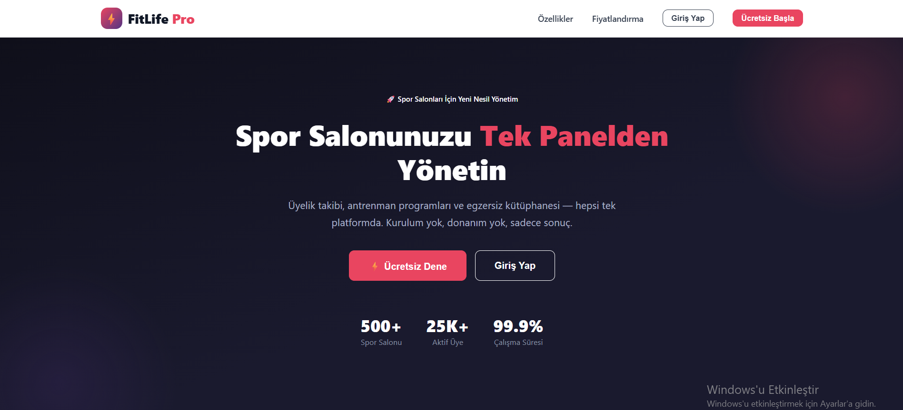
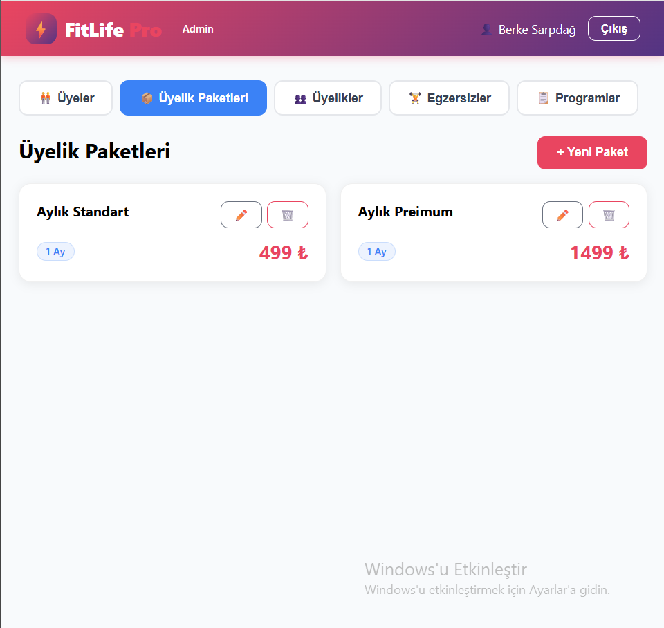
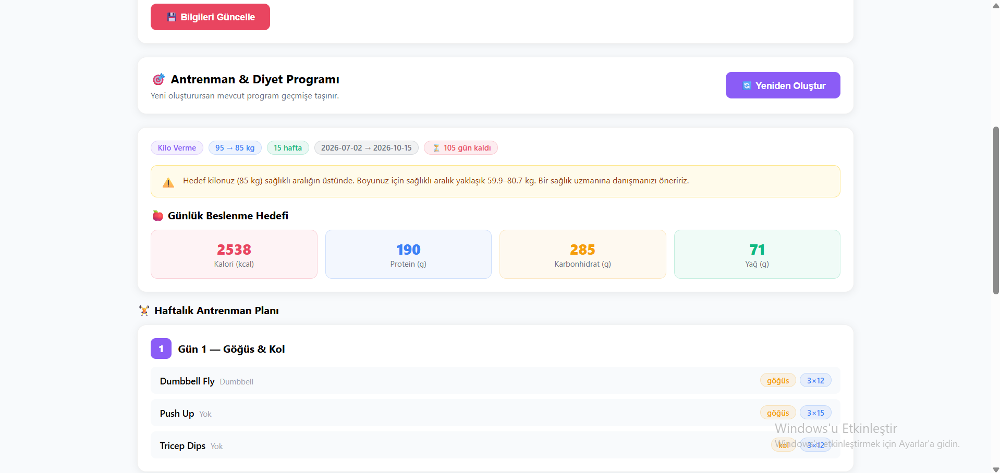
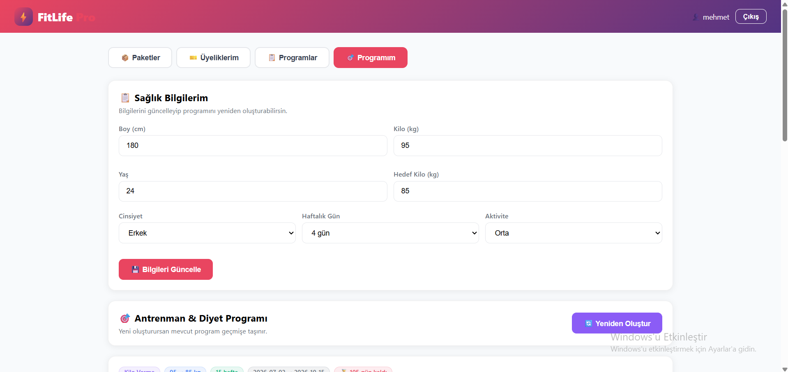
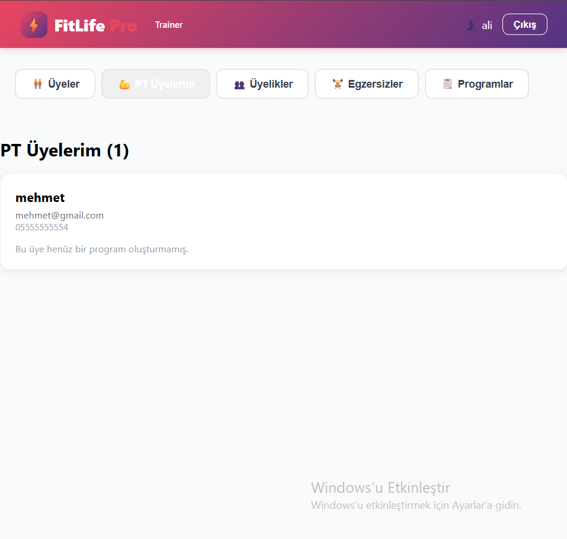

# 🏋️ FitLife Pro — Spor Salonu Yönetim Sistemi

Spor salonları için geliştirilmiş, rol tabanlı yetkilendirme ve üyelere özel
otomatik antrenman & diyet programı üretimi sunan tam yığın (full-stack) web uygulaması.

## 📋 Proje Hakkında

FitLife Pro; üyelik yönetimi, egzersiz kütüphanesi, antrenman programları ve
kişiselleştirilmiş fitness planlaması gibi bir spor salonunun ihtiyaç duyduğu
temel işlevleri tek bir platformda toplar. Üyeler kendi bilgilerini girerek
hedeflerine (kilo alma/verme) göre otomatik hesaplanan bir program alır;
yöneticiler ve antrenörler ise rollerine göre farklı yetkilerle sistemi yönetir.

## 🛠️ Kullanılan Teknolojiler

**Backend**
- NestJS (Node.js framework)
- PostgreSQL (veritabanı)
- TypeORM (ORM)
- JWT + Passport (kimlik doğrulama)
- class-validator (veri doğrulama)

**Frontend**
- React
- Fetch API (HTTP istekleri)

## ✨ Özellikler

### Kimlik Doğrulama & Yetkilendirme
- JWT tabanlı giriş/kayıt sistemi
- Üç rol: **Admin**, **Trainer (Antrenör)**, **Member (Üye)**
- Rol tabanlı erişim kontrolü (her rol yalnızca yetkili olduğu alanı görür)

### Üyelik Yönetimi
- Üyelik paketleri oluşturma/düzenleme (süre, fiyat, PT dahil mi)
- Üyelerin paket satın alması (otomatik başlangıç/bitiş tarihi hesabı)
- Admin ve antrenörler için üyelik takibi

### Kişiselleştirilmiş Fitness Programı
- Üye profili (boy, kilo, yaş, cinsiyet, hedef, aktivite seviyesi)
- BMR / TDEE / kalori / makro besin hesaplaması (Mifflin-St Jeor formülü)
- Hedefe ve haftalık antrenman gününe göre otomatik antrenman planı
- Sağlıklı hedef süresi hesabı ve sağlıksız hedef uyarıları
- Program geçmişi (eski programlar saklanır)

### Personal Training (PT)
- PT içeren üyelik paketleri
- Admin, PT'li paketi olan üyelere antrenör atar (iş kuralıyla korumalı)
- Antrenörler yalnızca kendilerine atanmış üyeleri ve programlarını görür

## 🚀 Kurulum

### Gereksinimler
- Node.js
- PostgreSQL

### 1. Projeyi klonlayın
```bash
git clone https://github.com/bsarpdag23/gym-project.git
cd gym-project
```

### 2. Backend kurulumu
```bash
cd gym-backend
npm install
```

`.env.example` dosyasını `.env` olarak kopyalayıp kendi değerlerinizi girin:
DB_USERNAME=postgres
DB_PASSWORD=sifreniz
DB_NAME=gym_db
JWT_SECRET=gizli-anahtar
PostgreSQL'de `gym_db` adında bir veritabanı oluşturun, ardından:
```bash
npm run start:dev
```
Backend `http://localhost:3001` adresinde çalışır.

### 3. Örnek egzersizleri yükleyin (opsiyonel)
```bash
npx ts-node src/seed.ts
```

### 4. Frontend kurulumu
```bash
cd ../gym-frontend
npm install
npm start
```
Frontend `http://localhost:3000` adresinde çalışır.

### 5. İlk admin hesabı
Kayıt olan her kullanıcı varsayılan olarak **üye** rolündedir. İlk admini
oluşturmak için veritabanından ilgili kullanıcının rolünü güncelleyin:
```sql
UPDATE users SET role = 'admin' WHERE email = 'sizin@mailiniz.com';
```

## 📸 Ekran Görüntüleri

### Ana Sayfa


### Üyelik Paketleri


### Kişiselleştirilmiş Fitness Programı



### PT Üyelerim


## 📝 Not

Bu proje öğrenme ve geliştirme amacıyla hazırlanmıştır. Ürettiği fitness ve
beslenme önerileri genel formüllere dayanır; kişiye özel sağlık tavsiyesi
yerine geçmez.
